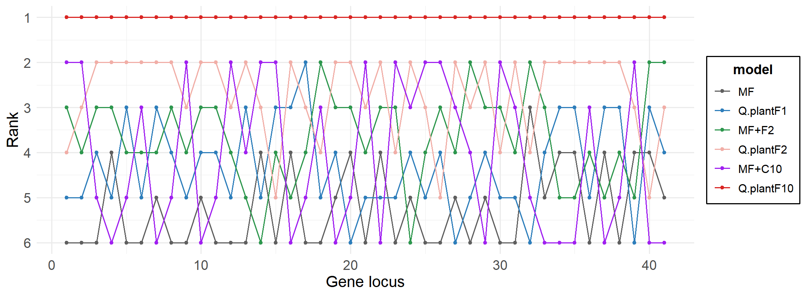

# **BIOL8706 Progress Record 3** 

Date：Oct 27th

> This record will include an analysis based on the results of the mixture model obtained from the full training set. For information on the full training set and output, see `data/subsample`。\
> For details on the method and dataset, please refer to Record 1 and Record 2.

All plotting code can be found in `process/data_analysis`.

## 1. Analysis of Frequency Vectors

### 1.1 PCA plot

In terms of scatter distribution, F1.1, as the original single profile model, is located near the (0,0) point. In contrast, the F10 and C10 models are randomly scattered around the F1.1 point. The marginal density plots on the top and right further display the distribution density of the two models on PC1 and PC2.

Overall, F10 and C10 exhibit differences across all internal profile components. These specific differences can be further observed through the heatmap in section 1.2.

Additionally, we also compared these mixture models, F10 and C10, with the empirical model based on a single profile, as shown in the figure below.

### 1.2  ComplexHeatmap Plot

From the figure, it can be seen that at certain amino acid sites, there is a corresponding high-frequency profile in both F10 and C10. However, a few profiles show significant differences, such as F10.3 and C10.8.

## 2. Analysis of Exchangeability Matrices

### 2.1 Pearson Correlation Coefficient

We calculated the Pearson correlation coefficients between the Q.plant matrix from Qmaker (Minh et al., 2021) and the new mixed models Q.plantF1, Q.plantF2, and Q.plantF10. Additionally, we presented specific differences in the internal parameters of exchangeability across various models using tables and bubble charts.

The results would be presented in the form of tables or heatmaps.

(a) heatmap:

(b) table:

| Matrix Comparison      | Pearson           | 1/3 (Greater 2x) | 2/3 (Greater 5x) | -1/3 (Less 2x) | -2/3 (Less 5x) |
|------------------------|-------------------|------------------|------------------|----------------|----------------|
| **Q.plant vs Q.plantF1**| 0.9766           |       1.11%     |       1.11%     |      29.92%     |      2.49%     |
| **Q.plantF1 vs Q.plantF2**| 0.9887            |       35.18%     |       2.77%     |      2.22%     |      0.33%     |
| **Q.plantF1 vs Q.plantF10**| 0.9698            |       35.18%     |       2.77%     |      2.22%     |      0.55%     |

### 2.2 The Bubble Plot

However, despite the high correlation between these models, there is a significant overall increase in relative substitution rates in Q.plantF2 compared to Q.plantF1. Most amino acid substitution rates have increased, with only two pairs of amino acids showing unchanged substitution rates. 

After adding 8 more profiles, the general trend of amino acid substitution rate evolution remains relatively unchanged compared to Q.plantF2. However, in Q.plantF10, the extent of change in each amino acid substitution rate relative to Q.plantF1 exhibits greater variability. This differs from Q.plantF2, where the percentage change in most substitution rates is relatively similar.

## 3. Testing the fit of the Q.plantFX models

### Ranking of Phylogenetic Models Based on Bayesian Information Criterion (BIC)

To evaluate the performance of the new mixture model, Q.plantFX, in fitting plant data, we compared the fit of various models to the test data using the Bayesian Information Criterion (BIC). We used the ModelFinder function (Kalyaanamoorthy et al., 2017) in IQ-TREE (Minh et al., 2020), to identify the best-fitting model from the existing empirical models. 

Specifically, we assessed the statistical fit of the following models on the test dataset: ModelFinder with a single profile, ModelFinder (empirical exchangeability) + F2 (profiles), ModelFinder (empirical exchangeability) + C10 (profiles), as well as our proposed mixture models, Q.plantF1, Q.plantF2, and Q.plantF10. 

