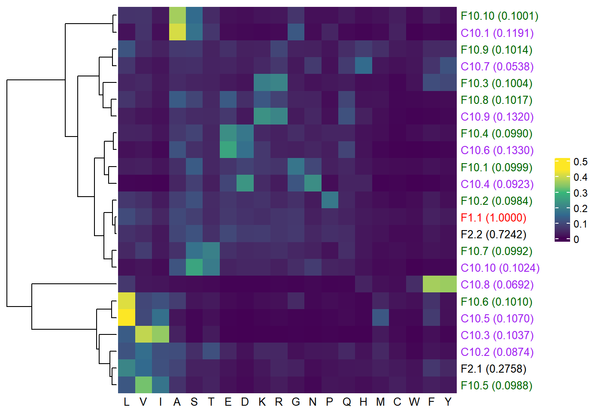

# Methods

## 1. Full Dataset Used

The dataset for this project is derived from the 1KP dataset, which contains records of approximately 470 different plant families. This project will randomly select plant sequences from 100 of these families, and from a total of 410 genes, randomly choose 369 (90%) gene sequences as the training set, with the remaining 41 (10%) genes as the testing set.

The summary for the subsample is as follows:

| Seqs        | Sites         | Loci          | Training      | Testing       |
|-------------|---------------|---------------|---------------|---------------|
| 100        | 155575        | 410           | 369           | 41            |

In the initial stages of Q matrix estimation, I plan to randomly generate several subsamples as described above and estimate their Q matrices under F1. Then, using the method outlined in section 2.1 of the data analysis, I will compare and analyze whether there are significant differences among these randomly generated subsamples and whether they differ from the original Q.plant.

For an example of the subsample, please refer to `data/sub1`.

## 2. Main Commands Used

Firstly, I used the following code to find the appropriate rate distribution for each gene locus:

```
iqtree-2.3.6.4.mixlink-Linux-intel/bin/iqtree2 -T 75 -S example_genes -mset LG,WAG,JTT -cmax 4 -pre Q1F1
```

Subsequently, starting from F1, iteratively estimate the Q matrix under different numbers of profiles: 

(Estimate from F1 to F10, each time using the Q matrix from the previous profile mixture model as the initial matrix.)

```
iqtree-2.3.6.4.mixlink-Linux-intel/bin/iqtree2 -T 75 -S output2/Q1F1.best_model.nex -te output2/Q1F1.treefile --model-joint "MIX{GTR20+F1}" --init-exchange LG -pre output2/QplantF1

iqtree-2.3.6.4.mixlink-Linux-intel/bin/iqtree2 -T 75 -S output2/Q1F1.best_model.nex -te output2/Q1F1.treefile --model-joint "MIX{GTR20+F2}" --init-exchange GTRPMIX -mdef output2/QplantF1.GTRPMIX.nex -pre output/QplantF2

...

iqtree-2.3.6.4.mixlink-Linux-intel/bin/iqtree2 -T 52 -S output/Q1F1.best_model.nex -te output/Q1F1.treefile --model-joint "MIX{GTR20+F10}" --init-exchange GTRPMIX -mdef output/QplantF9.GTRPMIX.nex --prefix output/QplantF10
```

Finally, extract the exchangeability from the `.iqtree` file using the following code for each result obtained from the estimation.

```
grep -A 21 "can be used as input for IQ-TREE" QplantF1.iqtree | tail -20 > Q.plantF1

grep -A 21 "lower-diagonal" QplantF2.iqtree | tail -20 > Q.plantF2

...

grep -A 21 "lower-diagonal" QplantF2.iqtree | tail -20 > Q.plantF10
```

Before performing data analysis and visualization, I also used the following command-line instructions to process the Q.plantFX files mentioned above (as well as other Q matrix files, such as Q.LG) to extract exchangeability and frequency vectors for separate analysis and to format them in a way that is more suitable for reading in R.

```
python Qcsv.py <input_folder>
```

# Data Analysis

> The following results will use the small dataset (10 species, 12 genes) as an example.<br>For more details, please see`data/example_genes` and `data/example_output`.

## 1. Analysis of Frequency Vectors

### 1.1 Line chart

Through line charts, it is possible to visually examine the information described by different frequency vectors, as well as to compare the frequency vectors within each profile mixture model and between different profile mixture models.

As shown in the figure below, it can be observed that the composition of frequency vectors for different profile mixture models follows a pattern: each model contains one or two frequency vectors with large fluctuations, while the remaining vectors exhibit smaller fluctuations. Starting from F4, the weights of the frequency vectors in all profile mixture models tend to equalize.

Within the same profile mixture model, the information contained in different frequency vectors is distinct. For example, the amino acids with the highest frequency and those with relatively high frequencies differ among the vectors. Taking F4 as an example, the vector F4.1 describes Leucine as the amino acid with the highest frequency, while F4.2 describes Serine as the one with the highest frequency.


### 1.2 PCA Plot

Using PCA plots to observe the potential patterns in the distribution of these frequency vectors and the different aspects of sequence characteristics they explain.


### 1.3 Clustering Diagram and ComplexHeatmap Plot

I generated a clustering diagram and further combined it with a heatmap to observe the similarities and differences between these frequency vectors.




### **Future Research:**

- Compare the differences in the information explained by these frequency vectors and C20-C60. (If they are significantly different, this might suggest that using these Q.plantFX could lead to more accurate results in constructing phylogenetic trees for plant sequences?)

- Read relevant literature on profile mixture models and continue to explore their biological significance...

## 2. Analysis of Exchangeability Matrices

### 2.1 PCA Plot

First, different species sequences and sites were randomly selected to estimate Q.plantF1. As shown in the figure below, the information they carry can be considered similar to that of the original Q.plant. The instability of different Q.plantF1 results may be due to the small size of the training dataset. (I expect that when using larger datasets, their results will be much closer.)


Subsequently, I estimated Q.plantF1 through Q.plantF8 generation by generation, and generated the PCA plot as shown below.

(a) From F1 to F8, according to the PCA results, the substitution matrices do not seem to have improved significantly. This could be due to the small size of the training dataset. If the same results are observed with larger datasets, it may indicate that the exchangeability of the original Q.plant is sufficient for use in profile mixture models within F10.

(b) The distance between Q.plantF1-Q.plantF8 and the original Q.plant in the plot is quite large, which is likely due to the relatively unstable results produced by the current small dataset used for estimation. (This dataset is the same as the one used in the previous figure to estimate Q.plantF1_1.)


**Idea:**

**If we consider every profile mixture model from F1 to F8 in the comparison, we might observe that the overall improvement of the Q matrix at each step is not significant (this can also be confirmed in the Pearson correlation figure in section 2.2). However, if we only consider F1 and F8, as shown in the figure below, we can see that the matrix might have some degree of improvement.**

**(Imagine using a larger dataset to train the model and comparing F1 with F10, F20, etc. I would expect to see more improvement in the Q matrix in such cases.)**

.png)

### **2.2 Future Research: Pearson Correlation Coefficient** [Added on September 5]

**For the new models obtained, such as Q.plantF1, Q.plantF10, Q.plantF20, etc., calculate their Pearson correlation coefficients with Q.plant from the original QMaker paper. This helps to validate the similarity or differences between them. (Alternatively, the percentage of positions where coefficients are larger or smaller can be compared, which can also be represented in a bubble plot.)**

**The results would be presented in the form of tables or heatmaps.**

**(a) Example of the heatmap:**

**As shown in the figure below, it displays the results of Pearson correlation calculations between Q.plantF1-F8, Q.LG, and Q.plant.**


**(b) Example of the table:**

| Matrix Comparison      | Pearson           | 1/3 (Greater 2x) | 2/3 (Greater 5x) | -1/3 (Less 2x) | -2/3 (Less 5x) |
|------------------------|-------------------|------------------|------------------|----------------|----------------|
| **Q.plant vs Q.plantF1**| 0.9489            |       34.07%     |       24.65%     |      13.57%     |      2.21%     |
| **Q.plant vs Q.plantF8**| 0.9563            |       40.72%     |       26.03%     |      9.69%     |      2.21%     |

**The content of this table can be used to supplement the explanation in the bubble plot in section 2.3.**

### **2.3 Future Research: The Bubble Plot** [Added on September 5]

**Use bubble plots to examine the relative differences in amino acid exchangeability coefficients between different models.**


## 3. Analyze the Q matrix

Using the test data, compare the performance of the estimated Q.plantFX with Q.plant, LG, WAG, JTT, and others.

- Observe the numerical differences in their log-likelihoods, AIC, and BIC.

- Alternatively, use the BIC criterion to count the number of times they are selected as the best model when constructing trees.

### **Future Research:** [Added on September 5]

**(a) Test whether the new models fit better to the data**

**Test the goodness of fit for the new models using the following command:**

```
iqtree -S test_genes -m MF -mset JTT,WAG,LG,Q.plant,Q.plantF1,Q.plantF10,Q.plantF20
```

**Count how many times different models are selected as the best model at each gene locus in the test dataset.**

**(b) Test whether the new models influence the topologies**

**For each gene locus, when the new model is selected as the best model, use it to infer the gene tree and compare it to the gene trees from the original 1KP paper.**

**The comparison method: nRF**

```
# Construct gene tree
iqtree -s example.phy -m Q.plantF20
```

```
# Calculate RF
iqtree -rf tree_set1 tree_set2
```

**And then, nRF equals to RF divided by 2(n−3), where n is the number of taxa.**

> [!Note]\
> **Question :**\
> The tested new models were only randomly selected from part of the 1KP dataset, so the original gene trees from the paper may not be directly available for comparison. Since the gene trees in the original paper were constructed using RAxML, should I:
> 1. Use RAxML to construct the gene trees for the filtered subsamples?
> 2. Use iqtree's ModelFinder to simulate the original paper and construct the gene trees?
